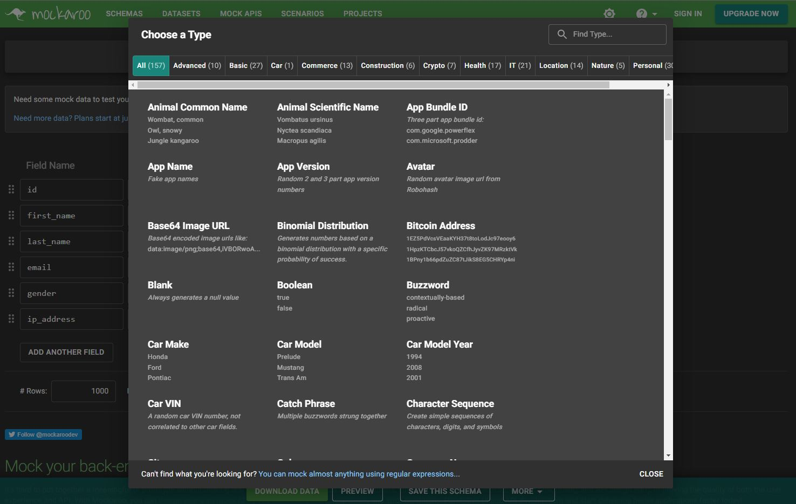
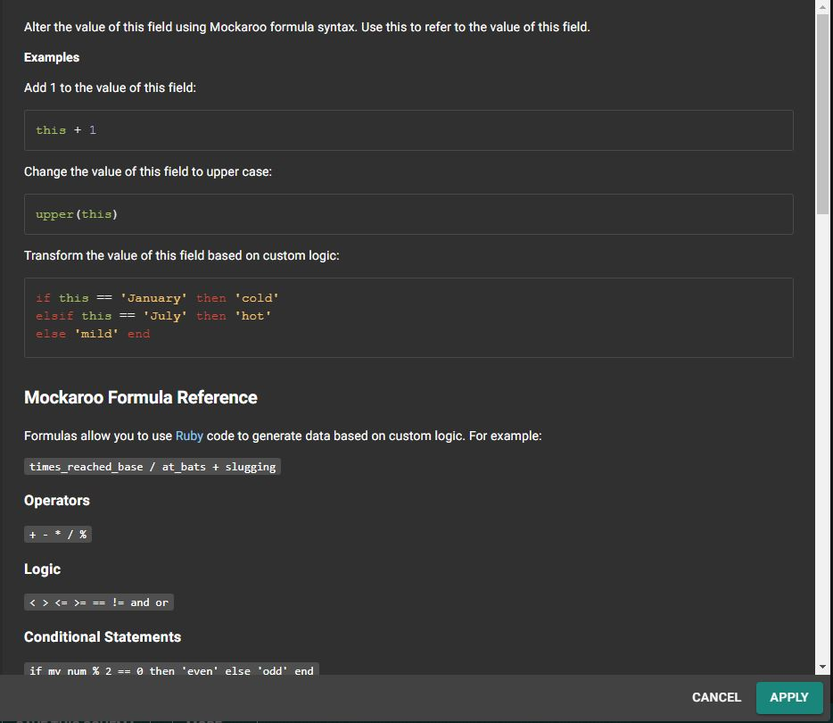
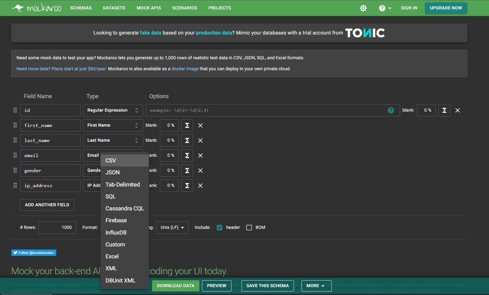
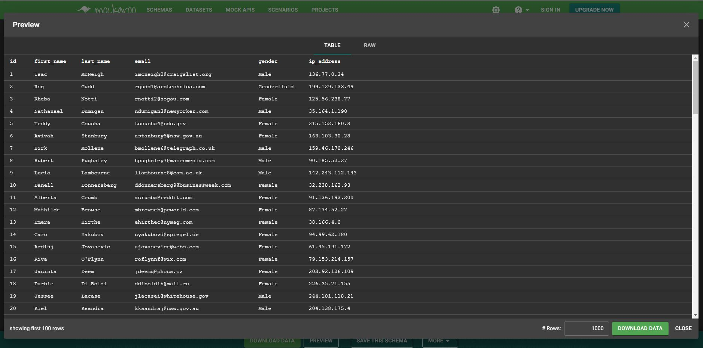

+++
categories = ['technical']
date = '2022-04-19T00:00:00+00:00'
draft = false
title = 'Developer Tools: Mockaroo'
+++

Have you ever needed to create a data collection to test your application? Mockaroo can help you with this task in a very quick and efficient way, for free.

This web tool offers more than 157 (as of April 19, 2022) data types to generate any values you need. The types are organized into groups such as *Commerce, IT, Location*, and include some interesting ones like *IP addresses, phone numbers, avatars, and even IBAN numbers*.

Mockaroo also gives us the ability to configure our own data generation rules to create custom types using regular expressions. This capability, combined with the built-in types it already offers, means we can practically generate any dataset we can imagine. Additionally, the generated values can be altered using functions and formulas.

After configuring the data types, we can preview a sample of the dataset and export it to various formats such as *CSV, JSON, plain text, SQL, Excel...* The free version allows us to export up to 1000 records, but nothing stops us from clicking the generate button multiple times to create more data of the same kind.

> 🖼️ Collection of Polyhedral Models. 1900. Max Brückner.