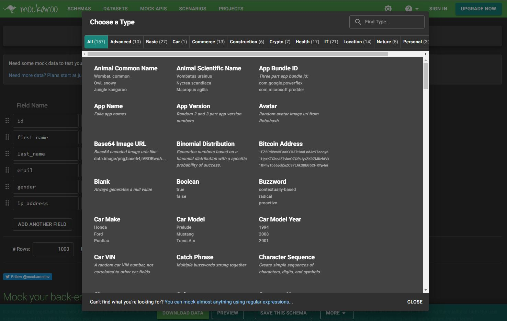
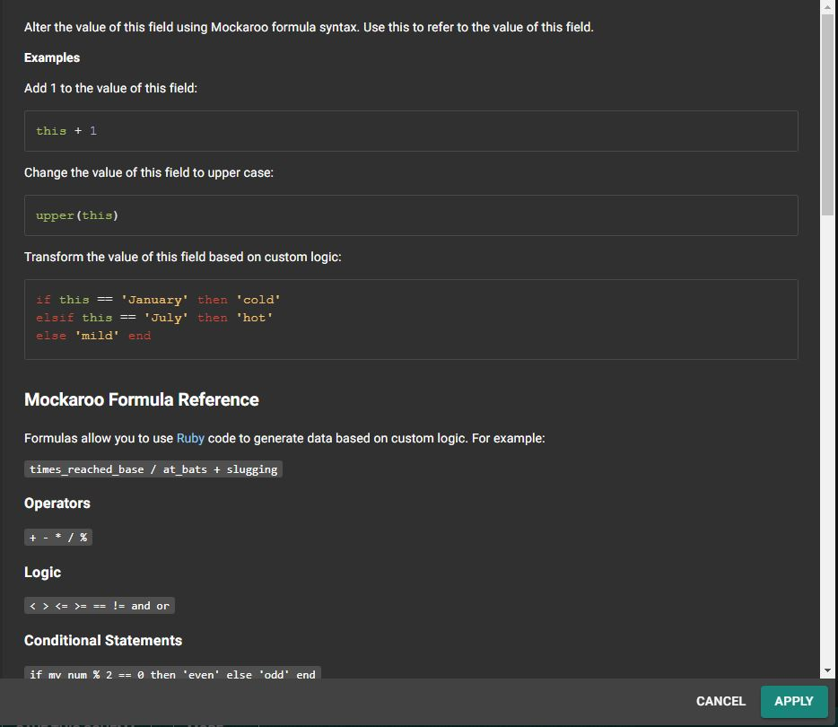

+++
categories = ['Blog Técnico']
date = '2022-04-19T00:00:00+00:00'
draft = false
title = 'Herramientas para desarrolladores: Mockaroo'
+++

¿Alguna vez has necesitado crear una colección de datos para testear tu aplicación? Mockaroo te puede ayudar con esta tarea de una forma muy rápida y eficiente de forma gratuita.

Esta herramienta web ofrece más de 157 (a 19 de abril de 2022) tipos de datos para generar los valores que quieras. Los tipos están organizados por grupos como *Comercio, IT, Localización* incluyendo algunos bastante interesantes como *direcciones IPs, teléfonos, avatares e incluso números IBAN*.

Mockaroo también nos da la posibilidad de configurar nuestras propias reglas de generación de datos para crear tipos personalizados mediante el uso de expresiones regulares. Esta capacidad, junto con los tipos nativos que ya nos ofrece, hace que prácticamente podamos crear cualquier set que se nos antoje. Además, los valores creados también pueden ser alterados mediante la ejecución de funciones y fórmulas.

Tras la configuración de los tipos de datos, podemos visualizar un extracto de la colección y exportarlo a diversos formatos como *CSV, JSON, texto, SQL, Excel...* La versión gratuita nos permite exportar hasta 1000 registros, pero nada nos impide pulsar el botón de generación varias veces para generar datos del mismo tipo.

> 🖼️ Coleción de Modelos Polihédricos. 1900. Max Brückner.