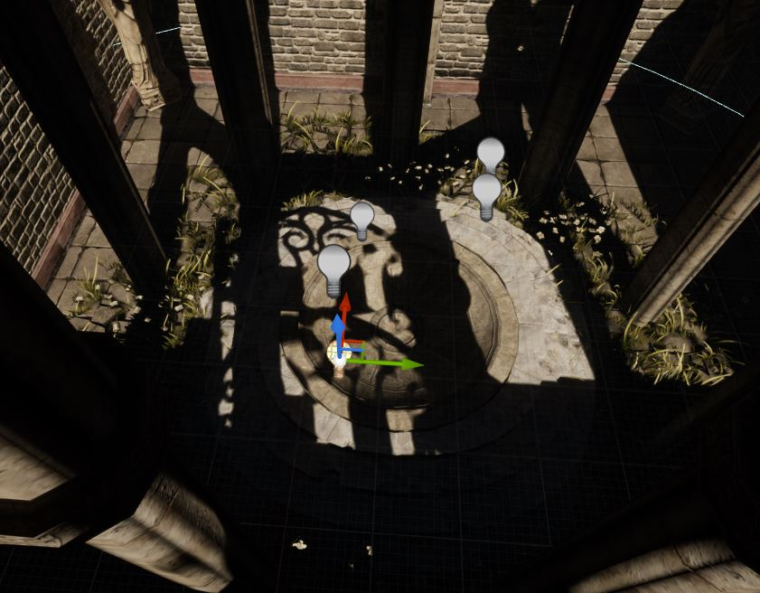
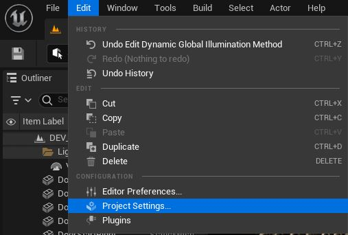
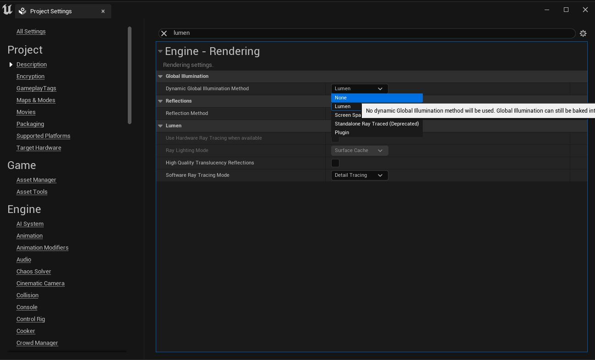
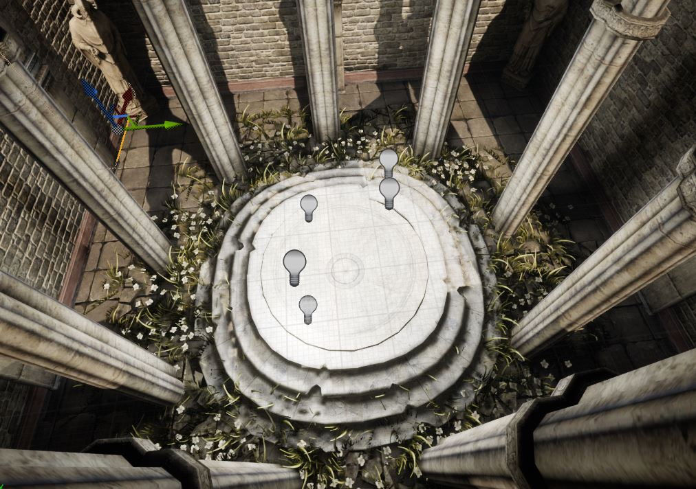

+++
categories = ['technical']
date = '2023-03-02T00:00:00+00:00'
draft = false
title = 'Fixing stuff: Static lighting in UE5'
+++

If you're working with UE and having issues with static lighting, this is the post for you.

This problem occurs because by default, the lighting system in UE5 projects is Lumen. In this post, I won't debate its advantages or disadvantages, but if you want to fix this issue easily—and have a potato PC like mine—follow these steps to continue using static lights 😉

First, go to **Edit > Project Settings**

In Project Settings, search for **Lumen** and select **"None"** in the *Dynamic Global Illumination Method* option.

After updating this setting, if you've already baked your static lighting, it should immediately appear in your current scene. If not, generate the lighting (bake lighting) and check your results.

> 🖼️ Sunset on the Sea. 1872. John Frederick Kensett
