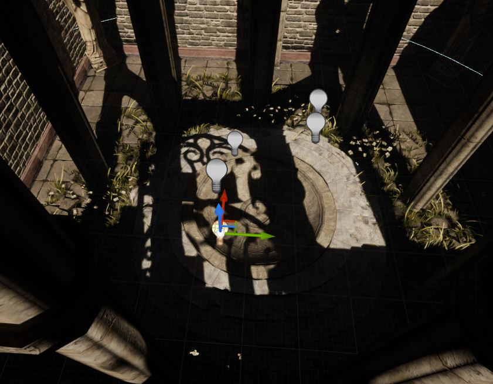
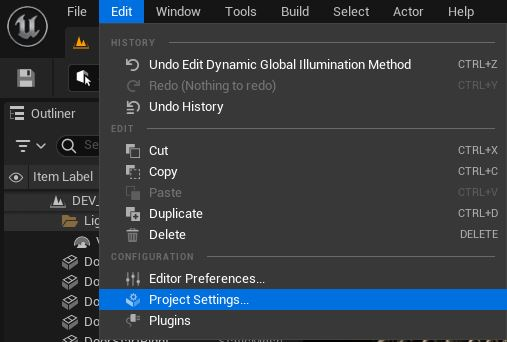
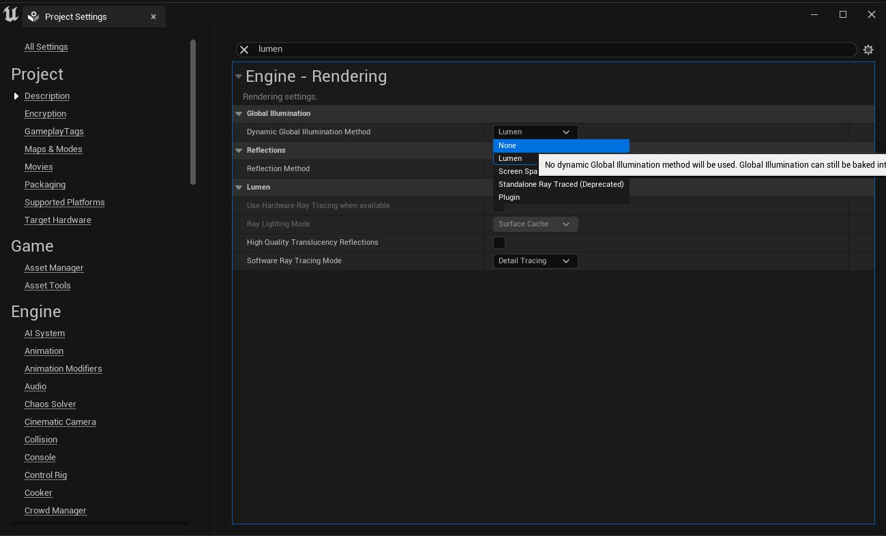
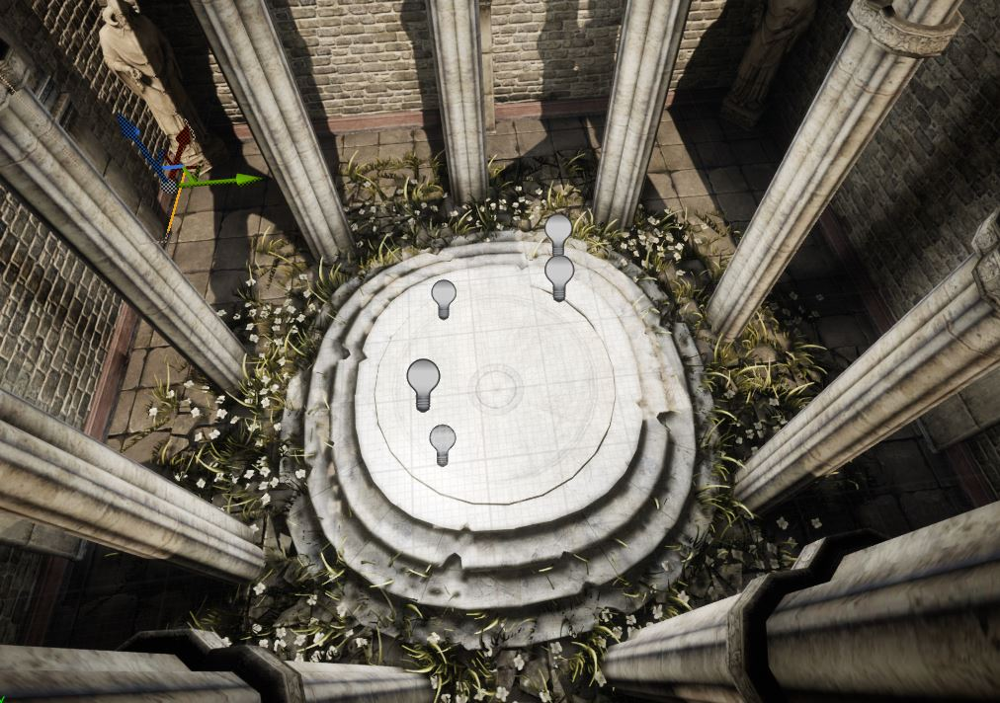

+++
categories = ['Blog Técnico']
date = '2023-03-02T00:00:00+00:00'
draft = false
title = '🛠 Arreglando cosillas: Iluminación estática en UE5'
+++

Si estás trabajando con UE, y tienes problemas porque la iluminación estática, este es tu post.

Este problema se debe a que por defecto, el sistema de iluminación en los proyectos de UE5 es Lumen. En este post no voy a debatir sus bondades o sus desventajas, pero si quieres solucionar este problema fácilmente y tienes un ordenador patata como el mio, sigue estos pasos para solucionar este problema y seguir haciendo uso de luces estáticas 😉

Primero ve a Edit > Project Settings

En Project Settings busca Lumen y selecciona "None" en la opción Dynamic Global Illumination Method.

Tras actualizar esta opción, si ya habías generado tu iluminación estática podrás ver cómo automáticamente aparece en la escena actual. Si no, genera la iluminación (bake lightning) y comprueba tus resultados

> 🖼️ Puesta de sol en el mar. 1872. John Frederick Kensett